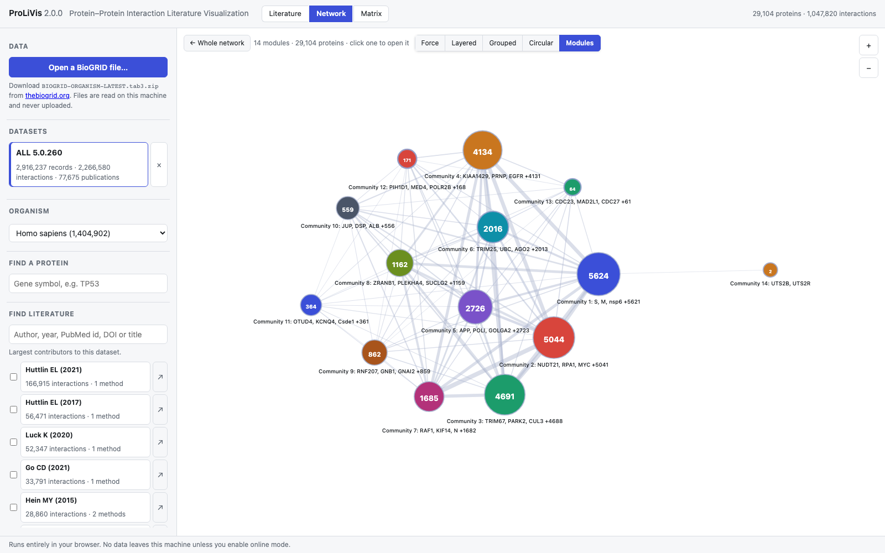
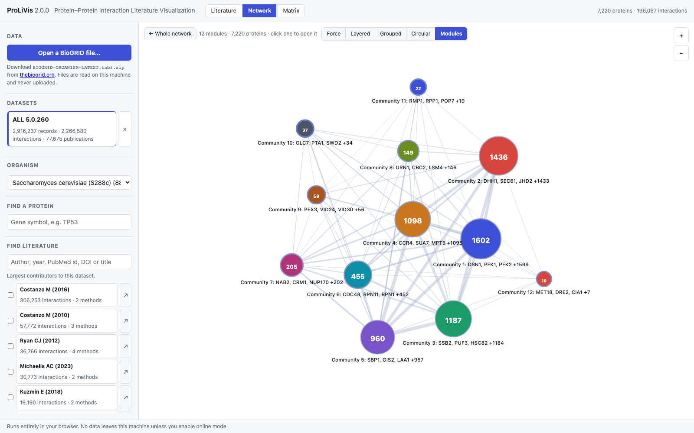
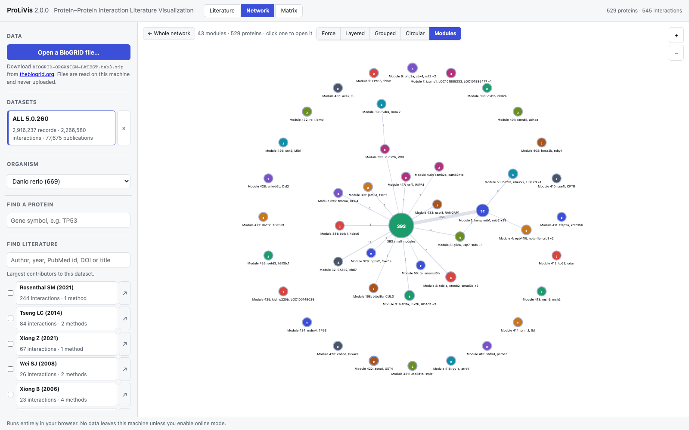
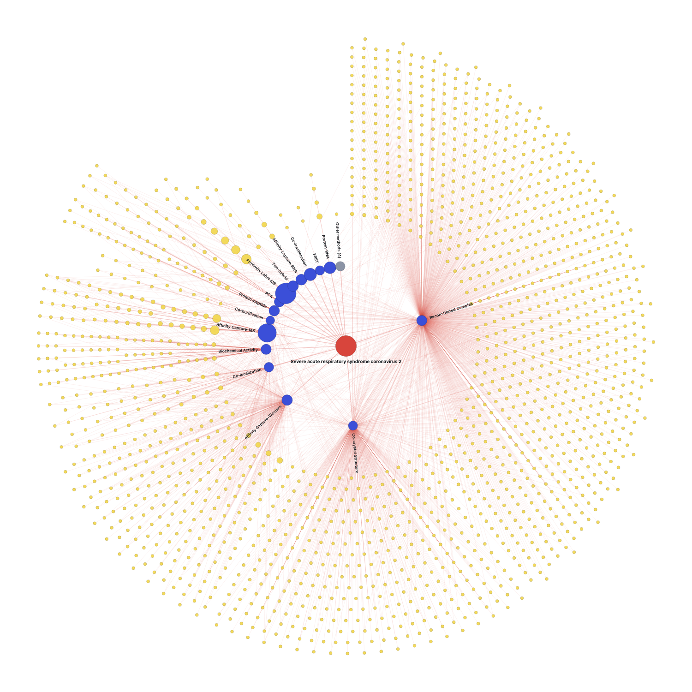
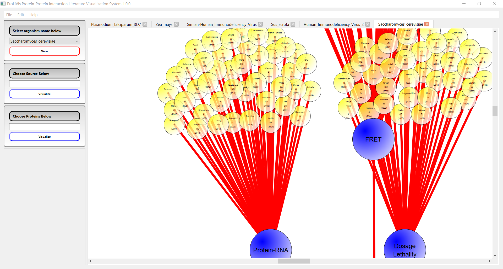
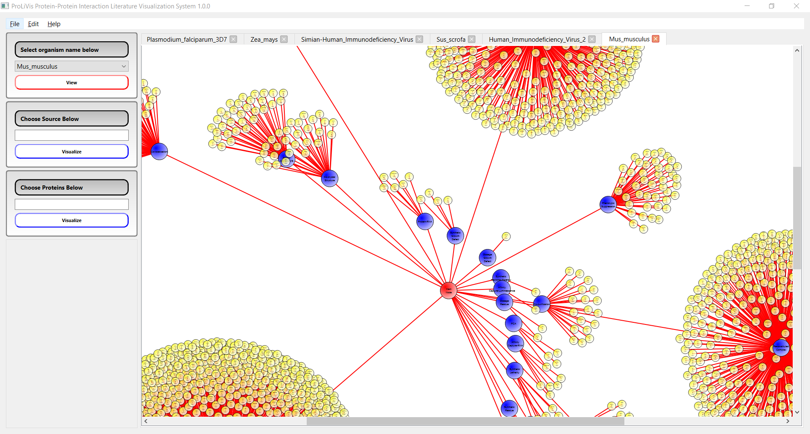
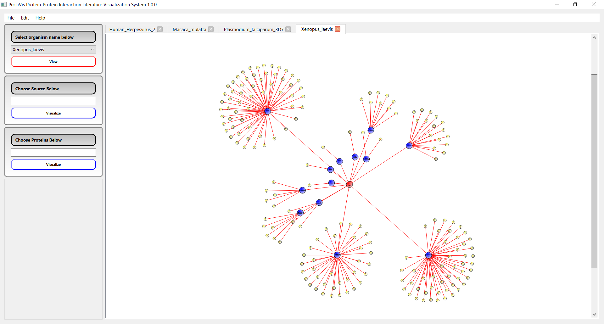

# ProLiVis — Protein–Protein Interaction Literature Visualization

BioGRID records evidence without weighing it. An interaction asserted once by a single
high-throughput screen and one confirmed by twenty laboratories across a dozen assays
are the same kind of row in the same file, and a tool that draws both as an edge states
that two proteins interact without stating how much anyone should believe it.

ProLiVis visualizes a PPI network **through its literature** — publications and
experimental methods are nodes in their own right, so you see *who found what, with
which method* — and scores every interaction by how well the literature actually
supports it.

> **Paper:** Melih Sozdinler, *ProLiVis: Protein-Protein Interaction Literature
> Visualization System*, [arXiv:2111.12794](https://arxiv.org/abs/2111.12794).
> The 2.0 manuscript is in [`paper/`](paper/) — [PDF](paper/prolivis2.pdf).

**Open <https://melihsozdinler.github.io/CenterLayout/> and drag in a BioGRID download.**
There is nothing to install, and nothing leaves your machine.

---

## Two things live in this repository

| Path | What it is | Status |
| --- | --- | --- |
| [`web/`](web/) | **ProLiVis 2.0** — a zero-install static web application. TypeScript, runs entirely in the browser. | Active development |
| repository root (`*.cpp`, `*.h`, `CenterLayout.pro`) | **ProLiVis 1.0** — the original Qt desktop application described in the paper. | Archived, unmaintained |

The 1.0 sources are kept verbatim as the reference implementation behind the published
figures. They are *not* buildable as-is: the Qt `.ui` files and the external layout
engine (`ProlivisAuto.exe`) were never part of this repository, and the Qt 4 → Qt 5 port
is incomplete. ProLiVis 2.0 is a from-scratch rewrite, not a port.

---

## What it looks like



*The complete human interactome of BioGRID 5.0.260 — 29,104 proteins, 1,047,820
interactions, no trust threshold — drawn as the fourteen communities it divides into.
Node area is proteins in the module, the ring is how well its interior is supported,
link width is interactions spanning two modules. Click one to open it.*

### The same two views, six organisms

Nothing is reconfigured between these. A network's shape follows how much it has been
studied, and the pictures say so.

| Organism | Publications | Proteins | Interactions | One level up | |
| --- | ---: | ---: | ---: | --- | --- |
| *Homo sapiens* | 16,148 | 29,104 | 1,047,820 | 14 communities | [literature](docs/screenshots/human-literature.png) · [modules](docs/screenshots/human-modules.png) |
| *Saccharomyces cerevisiae* | 15,698 | 7,220 | 196,067 | 12 communities | [literature](docs/screenshots/yeast-literature.png) · [modules](docs/screenshots/yeast-modules.png) |
| *Drosophila melanogaster* | 8,068 | 11,121 | 68,724 | 59 communities | [literature](docs/screenshots/fly-literature.png) · [modules](docs/screenshots/fly-modules.png) |
| *Mus musculus* | 5,143 | 19,372 | 101,623 | 47 communities | [literature](docs/screenshots/mouse-literature.png) · [modules](docs/screenshots/mouse-modules.png) |
| *Arabidopsis thaliana* | 2,456 | 11,729 | 73,414 | 36 communities | [literature](docs/screenshots/arabidopsis-literature.png) · [modules](docs/screenshots/arabidopsis-modules.png) |
| *Danio rerio* | 84 | 529 | 545 | 43 biconnected modules | [literature](docs/screenshots/zebrafish-literature.png) · [modules](docs/screenshots/zebrafish-modules.png) |

Yeast divides into a dozen communities whose members name themselves — the proteasome,
the chaperones, the nuclear pore:



Zebrafish is the other extreme, and the picture is not a failure of the layout. With 529
proteins and 545 interactions the reported network is barely more than a forest: almost
every module is a single bridge, so they fold into one node and hang off it.



The literature view is the other half — the organism at the centre, experimental methods
on a ring, publications fanning out within their method's sector:



*SARS-CoV-2 from the same release: 1,688 publications across 19 methods. Sector width is
share of the literature, node area is interactions contributed — so the widest sectors
are where most* papers *are, and the largest nodes are where most* interactions *are.
They are not the same methods.*

The gallery is generated, not curated: `npm run screenshots` re-shoots every image above
from a BioGRID release. Counts are in
[`docs/screenshots/gallery.json`](docs/screenshots/gallery.json).

---

## What it does

- **Ingests BioGRID** offline (drag in a `BIOGRID-*.tab3.zip`) or online (the REST API,
  with your own access key). The complete release — 2.9M records, 1.55 GB uncompressed
  — ingests in 78 seconds and is then queried locally.
- **Rebuilds the center layout** — organism → method → publication — deterministically,
  so a figure can be regenerated exactly. ProLiVis 1.0 could not do this even for its
  own author: its layout engine was an external binary that is now lost.
- **Filters the literature** by what a publication contributed — interactions, proteins
  touched, or method — and recomputes the method ring from what survives. The complete
  human literature does not fit one picture; this is how you choose which part you are
  looking at.
- **Scores every interaction** with a documented citation-trust model: replication,
  **independent laboratories**, method diversity, assay directness, throughput,
  literature impact, currency. Unknown inputs are reported as unknown, never as zero.
- **Reads a network too large to draw** one level up: modules as nodes, evidence as
  links, and any module opens into its own high-level graph. Four clicks take you from
  the million-interaction human network to 53 proteins.
- **Extracts structure**: maximal cliques, biconnected components, articulation points,
  bridges, *k*-cores, communities, and edge-removal cascades — including removal in
  *trust-ascending* order, which asks what survives if you only believe the evidence.
- **Collects literature into datasets**: tick papers across several searches, visualize
  their combined network, save it as a dataset in its own right — scorable, exportable,
  and remembering which publications produced it.
- **Compares and merges** datasets across organisms, releases or queries, keeping
  per-edge provenance.
- **More views**: the adjacency matrix, and the protein-level network with force,
  layered, grouped, circular and ego arrangements. UpSet of method combinations,
  bipartite publication↔protein with method lanes, literature timeline and method chord
  are computed through the API but not yet drawn in the interface — see the
  [supplement](paper/supplement.pdf) for their output.
- **Exports** the figure as SVG from the interface, and to CSV/TSV, GraphML, GML and
  SIF (Cytoscape) through the API, plus a session manifest that reproduces any figure.

**Your data stays on your machine.** Bulk dumps are parsed and queried locally in the
browser. Nothing is uploaded; the network is touched only if you turn on online mode or
literature enrichment, and both are optional.

---

## Install

Nothing, if you like: open <https://melihsozdinler.github.io/CenterLayout/>. Otherwise:

```bash
git clone https://github.com/melihsozdinler/CenterLayout
cd CenterLayout/web
npm ci
npm run dev
```

Requires Node.js ≥ 20.19. [`docs/INSTALL.md`](docs/INSTALL.md) covers all four options,
including air-gapped use, which BioGRID files to download, and troubleshooting.

Then get the data from <https://downloads.thebiogrid.org/BioGRID>. Start with
`BIOGRID-ORGANISM-LATEST.tab3.zip` if you want one species, or
`BIOGRID-CORONAVIRUS-LATEST.tab3.zip` (5 MB) for a quick look.

## Documentation

| | |
| --- | --- |
| [`docs/INSTALL.md`](docs/INSTALL.md) | Getting it running, and getting the data |
| [`docs/USAGE.md`](docs/USAGE.md) | The views, scoring, analysis, comparison, export |
| [`docs/TRUST.md`](docs/TRUST.md) | The citation-trust model in full, with its equations |
| [`docs/DATA.md`](docs/DATA.md) | Schema, and three things about BioGRID worth knowing |
| [`docs/ALGORITHMS.md`](docs/ALGORITHMS.md) | What each algorithm computes and what it costs |
| [`paper/`](paper/) | The 2.0 manuscript, its figures, and how both are generated |
| [`paper/supplement.pdf`](paper/supplement.pdf) | Every capability, with a figure each, and where each one lives |

Everything the interface does is also available as `window.prolivis` in the browser
console — a supported interface, not a debugging hook. The tool's own tests and every
figure in the paper are produced through it.

```js
const dataset = await prolivis.load(file)
const scored  = await prolivis.score({ datasetId: dataset.datasetId })
const graph   = await prolivis.graph({ datasetId: dataset.datasetId }, { minScore: 0.4 })
console.log(prolivis.cliques(graph, { minSize: 3 }))
```

## Development

```bash
npm run lint         # eslint
npm test             # vitest unit tests
npm run build        # type-check + production build to dist/
npm run test:e2e     # playwright end-to-end against the built app
npm run figures      # regenerate the paper's figures and its measured numbers
npm run screenshots  # re-shoot the organism gallery above
```

The last two need a BioGRID release on disk; see [`paper/README.md`](paper/README.md).
Scale and online-mode tests are skipped unless you point them at real data or a key:

```bash
PROLIVIS_BIG_FIXTURE=~/Downloads/BIOGRID-ALL-LATEST.tab3.zip npm run test:e2e -- scale
```

---

## ProLiVis 1.0 (archived)

The original Qt application, as published:





---

## Licensing

- `web/` and all ProLiVis 2.0 material: **MIT** (see [`LICENSE`](LICENSE)).
- The archived 1.0 C++ sources carry **GPL-3** headers
  (© 2013 Melih Sozdinler, Turkan Haliloglu, Can Ozturan) and remain under those terms.

## Citing

Until the ProLiVis 2.0 paper is published, please cite the original:

```bibtex
@article{sozdinler2021prolivis,
  title   = {ProLiVis: Protein-Protein Interaction Literature Visualization System},
  author  = {Sozdinler, Melih},
  journal = {arXiv preprint arXiv:2111.12794},
  year    = {2021}
}
```
